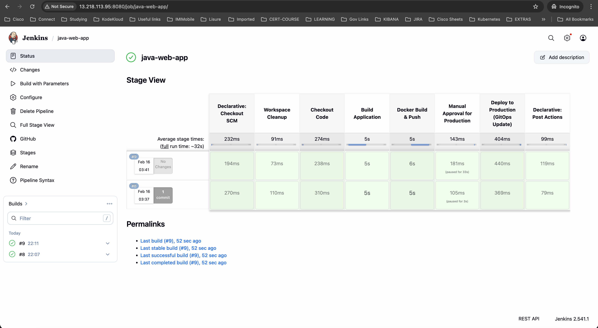

# Spring Boot based Java web application
 
This is a simple Sprint Boot based Java application that can be built using Maven. Sprint Boot dependencies are handled using the pom.xml 
at the root directory of the repository.

This is a MVC architecture based application where controller returns a page with title and message attributes to the view.

### DevSecOps Architecture


---

### 🔄 CI/CD Flow



## Execute the application locally and access it using your browser

Checkout the repo and move to the directory

```
git clone https://github.com/AvikCodeCrafter/Jenkins-Java-springboot-webapp-Sonar-argo-k8s-gitops.git

```

Execute the Maven targets to generate the artifacts

```
mvn clean package
```

The above maven target stroes the artifacts to the `target` directory. You can either execute the artifact on your local machine
(or) run it as a Docker container.

** Note: To avoid issues with local setup, Java versions and other dependencies, I would recommend the docker way. **


### Execute locally (Java 17 needed) and access the application on http://localhost:8080 or on EIP/EC2 Public IP on port 8080.
make sure to open port 8080 on security group 

```
java -jar target/spring-boot-web.jar
```

### The Docker way

Build the Docker Image

```
docker build -t java-springboot-webapp:v1 .
```

```
docker run -d -p 8010:8080 -t java-springboot-webapp:v1
```

Hurray !! Access the application on `http://<ip-address>:8010` make sure to open port 8010 on security group 

### **EKS Installation**

- ☸️ [AWS-EKS Deployment-Install](EKS-Cluster-Setup.md)

### **Jenkins Installation** 

- 🚀 [Jenkins-CI/CD Installtion](JenkinsInstall.md)

## Next Steps

# 🚀 SonarQube Installation Guide (Ubuntu EC2 - Production Style)

This guide explains how to install and configure SonarQube 10.x on an
Ubuntu EC2 instance properly.

------------------------------------------------------------------------

# 📌 Prerequisites

-   Ubuntu EC2 Instance
-   Minimum 2GB RAM (4GB Recommended)
-   Open Port 9000 in Security Group

------------------------------------------------------------------------

# 🛠️ Step 1: Install Required Packages

``` bash
sudo apt update -y
sudo apt install unzip wget openjdk-17-jdk -y
```

Verify Java installation:

``` bash
java -version
```

------------------------------------------------------------------------

# 👤 Step 2: Create SonarQube User

SonarQube should NOT run as root.

``` bash
sudo adduser --system --no-create-home --group --disabled-login sonarqube
```

------------------------------------------------------------------------

# 📥 Step 3: Download SonarQube

``` bash
cd /opt
sudo wget https://binaries.sonarsource.com/Distribution/sonarqube/sonarqube-10.4.1.88267.zip
```

------------------------------------------------------------------------

# 📦 Step 4: Unzip and Rename

``` bash
sudo unzip sonarqube-10.4.1.88267.zip
sudo mv sonarqube-10.4.1.88267 sonarqube
```

------------------------------------------------------------------------

# 🔐 Step 5: Set Proper Permissions

``` bash
sudo chown -R sonarqube:sonarqube /opt/sonarqube
sudo chmod -R 755 /opt/sonarqube
```

------------------------------------------------------------------------

# ⚙️ Step 6: Configure System Limits (Mandatory)

### Update Kernel Parameters

``` bash
sudo nano /etc/sysctl.conf
```

Add:

    vm.max_map_count=262144
    fs.file-max=65536

Apply changes:

``` bash
sudo sysctl -p
```

------------------------------------------------------------------------

### Update Security Limits

``` bash
sudo nano /etc/security/limits.conf
```

Add:

    sonarqube   -   nofile   65536
    sonarqube   -   nproc    4096

------------------------------------------------------------------------

# ▶️ Step 7: Start SonarQube

Switch to sonarqube user:

``` bash
sudo su - sonarqube
cd /opt/sonarqube/bin/linux-x86-64
./sonar.sh start
```

Check status:

``` bash
./sonar.sh status
```

------------------------------------------------------------------------

# 🌐 Access SonarQube

Open in browser:

http://`<EC2-Public-IP>`{=html}:9000

Default Credentials:

Username: admin\
Password: admin

------------------------------------------------------------------------

# 🚀 (Optional) Enable SonarQube as Systemd Service

Create service file:

``` bash
sudo nano /etc/systemd/system/sonarqube.service
```

Add:

    [Unit]
    Description=SonarQube Service
    After=network.target

    [Service]
    Type=forking
    User=sonarqube
    Group=sonarqube
    ExecStart=/opt/sonarqube/bin/linux-x86-64/sonar.sh start
    ExecStop=/opt/sonarqube/bin/linux-x86-64/sonar.sh stop
    Restart=always
    LimitNOFILE=65536
    LimitNPROC=4096

    [Install]
    WantedBy=multi-user.target

Reload and enable:

``` bash
sudo systemctl daemon-reload
sudo systemctl enable sonarqube
sudo systemctl start sonarqube
sudo systemctl status sonarqube
```


Hurray !! Now you can access the `SonarQube Server` on `http://<ip-address>:9000` 

--------------------------------------------------------------------------

# 🚀 (Optional) Install Sonarqube as Docker Container :) Much Easy Right 

- <b id="Sonar">Install and configure SonarQube (Master machine)</b>
```bash
docker run -itd --name SonarQube-Server -p 9000:9000 sonarqube:lts-community
docker run -itd --name SonarQube-Server -p 9000:9000 sonarqube:community   #Recommmended to use 

```

